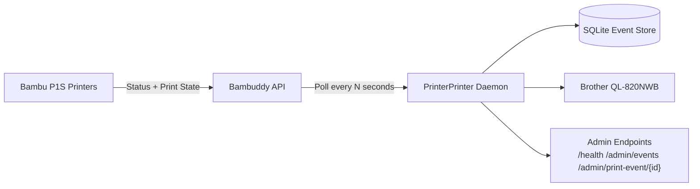

# PrinterPrinter

PrinterPrinter is a local daemon that runs alongside Bambuddy, watches configured Bambu printers for print starts, and auto-prints job labels to a Brother QL-820NWB.

## Architecture



## Example Output

Latest label preview (DK1202 / 62x100):


## Features

- Bambuddy connectivity check and printer discovery
- Print-start detection from printer state transitions
- Event persistence in SQLite
- Automatic label print on new start events
- Manual reprint endpoint
- Configurable price-per-gram and optional price display
- User-friendly date/time and duration formatting

## API Endpoints

- `GET /health`
- `GET /probes/bambuddy`
- `POST /admin/poll-once`
- `GET /admin/printers`
- `GET /admin/events`
- `POST /admin/print-event/{event_id}`

## Configuration

Copy `.env.example` to `.env` and update values.

### Core

- `PRINTERPRINTER_HOST` (default `0.0.0.0`)
- `PRINTERPRINTER_PORT` (default `8080`)
- `PRINTERPRINTER_LOG_LEVEL` (default `INFO`)
- `PRINTERPRINTER_DB_PATH` (default `./data/printerprinter.sqlite3`)
- `PRINTERPRINTER_POLL_INTERVAL_SECONDS` (default `5`)
- `PRINTERPRINTER_MONITORED_PRINTER_IDS` (comma-separated Bambuddy numeric IDs, empty means all)
- `PRINTERPRINTER_MONITORED_PRINTER_IDENTIFIERS` (comma-separated IDs, names, serials, or IPs to auto-resolve)

### Bambuddy

- `BAMBUDDY_BASE_URL` (example `http://10.206.50.172:8000`)
- `BAMBUDDY_API_TOKEN`
- `BAMBUDDY_TIMEOUT_SECONDS` (default `15`)
- `BAMBUDDY_AUTH_MODE` (`bearer`, `api_key_header`, `none`)
- `BAMBUDDY_AUTH_HEADER_NAME` (default `X-API-Key`)
- `BAMBUDDY_JOBS_ENDPOINT` (default `/api/v1/print-log/`)
- `BAMBUDDY_PRINTERS_ENDPOINT` (default `/api/v1/printers/`)
- `BAMBUDDY_PRINTER_STATUS_ENDPOINT_TEMPLATE` (default `/api/v1/printers/{printer_id}/status`)

### Brother QL-820NWB

- `BROTHER_ENABLED` (`true`/`false`)
- `BROTHER_MODEL` (default `QL-820NWB`)
- `BROTHER_PRINTER_URI` (example `tcp://10.206.58.111:9100`)
- `BROTHER_LABEL_SIZE` (default `62x100`, DK1202)
- `BROTHER_CUT` (`true`/`false`)

### Pricing

- `SHOW_PRICE_ON_LABEL` (`true`/`false`)
- `FILAMENT_PRICE_PER_GRAM` (default `0.10`)

If price display is enabled, filament is shown as:

- `Filament: 42g ($4.20)`

Mass is rounded to the nearest gram before both display and price calculation.

## Local Development

1. Create and activate a virtual environment.
2. Install dependencies.
3. Configure `.env`.
4. Run the daemon.

```bash
python3 -m venv .venv
. .venv/bin/activate
pip install -e .
uvicorn printerprinter.main:app --host 0.0.0.0 --port 8080
```

Quick checks:

```bash
curl http://localhost:8080/health
curl http://localhost:8080/probes/bambuddy
curl http://localhost:8080/admin/printers
curl -X POST http://localhost:8080/admin/poll-once
curl http://localhost:8080/admin/events
```

## Raspberry Pi Setup (Recommended for always-on deployment)

### Automated Setup (Recommended)

Run a single command to fully set up PrinterPrinter with interactive configuration prompts:

```bash
sudo bash <(curl -fsSL https://raw.githubusercontent.com/bobbylindsey/PrinterPrinter/main/scripts/setup-rpi.sh)
```

Or specify a different branch:

```bash
sudo bash <(curl -fsSL https://raw.githubusercontent.com/bobbylindsey/PrinterPrinter/develop/scripts/setup-rpi.sh)
```

The setup script will:
- Check and install system dependencies
- Clone or update the repository
- Create a Python virtual environment
- Install dependencies
- Prompt you for all configuration values (Bambuddy address, API key, printer IPs, pricing, etc.)
- Create a systemd service file
- Enable and start the daemon

After setup completes, monitor logs with:

```bash
journalctl -u printerprinter -f
```

### Manual Setup (Alternative)

If you prefer to set up manually, follow these steps:

These instructions assume Raspberry Pi OS 64-bit and Python 3.11+.

1. Install system packages.

```bash
sudo apt update
sudo apt install -y git python3 python3-venv python3-pip
```

2. Clone and install.

```bash
git clone <your-repo-url> PrinterPrinter
cd PrinterPrinter
python3 -m venv .venv
. .venv/bin/activate
pip install -e .
cp .env.example .env
```

3. Edit `.env` for your network:

- `BAMBUDDY_BASE_URL=http://<bambuddy-ip>:8000`
- `BROTHER_PRINTER_URI=tcp://<brother-ip>:9100`
- `BAMBUDDY_API_TOKEN=<token>`

4. Create systemd service.

`/etc/systemd/system/printerprinter.service`

```ini
[Unit]
Description=PrinterPrinter Daemon
After=network-online.target
Wants=network-online.target

[Service]
Type=simple
User=pi
WorkingDirectory=/home/pi/PrinterPrinter
EnvironmentFile=/home/pi/PrinterPrinter/.env
ExecStart=/home/pi/PrinterPrinter/.venv/bin/uvicorn printerprinter.main:app --host 0.0.0.0 --port 8080
Restart=always
RestartSec=5

[Install]
WantedBy=multi-user.target
```

5. Enable and start.

```bash
sudo systemctl daemon-reload
sudo systemctl enable printerprinter
sudo systemctl start printerprinter
sudo systemctl status printerprinter
```

6. View logs.

```bash
journalctl -u printerprinter -f
```

## Docker Setup (Sidecar with Bambuddy)

This repository includes:

- `Dockerfile`
- `docker-compose.example.yml`

### Option A: PrinterPrinter container, Bambuddy external

1. Set `.env` with Bambuddy LAN URL, for example:

- `BAMBUDDY_BASE_URL=http://10.206.50.172:8000`

2. Build and run:

```bash
docker compose -f docker-compose.example.yml up -d --build
```

### Option B: PrinterPrinter + Bambuddy in same Compose project

If your Bambuddy service is named `bambuddy` in compose, set:

- `BAMBUDDY_BASE_URL=http://bambuddy:8000`

Use shared compose network (default) so service DNS works.

### Docker networking notes

- On Linux, `network_mode: host` may simplify LAN printer discovery/access.
- On macOS/Windows Docker Desktop, host networking differs; prefer direct IP routing where possible.
- Ensure container can reach TCP `9100` on Brother printer.

## Operational Tips

- Keep API tokens out of git; do not commit `.env`.
- Use `PRINTERPRINTER_MONITORED_PRINTER_IDS` to limit label scope.
- If labels fail, test printer reachability:

```bash
ping <brother-ip>
nc -vz <brother-ip> 9100
```

- Trigger manual reprint by event ID:

```bash
curl -X POST http://localhost:8080/admin/print-event/123
```

## Troubleshooting

- `Wrong roll type`: verify `BROTHER_LABEL_SIZE=62x100` for DK1202.
- No prints: verify `BROTHER_ENABLED=true` and printer URI.
- Bambuddy timeout/DNS issues: use direct IP in `BAMBUDDY_BASE_URL`.
- Price hidden unexpectedly: verify `SHOW_PRICE_ON_LABEL=true`.
